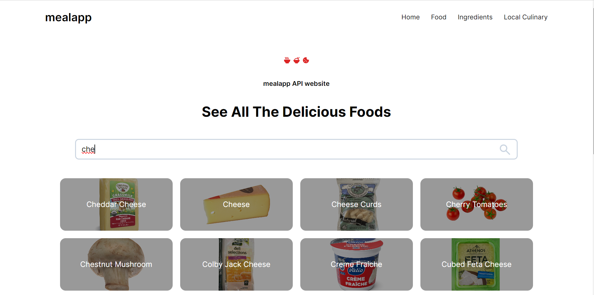
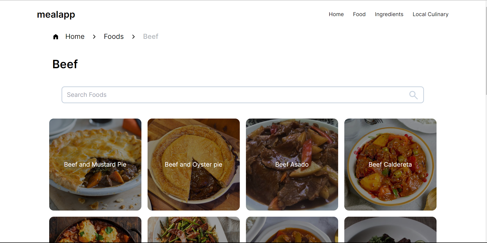
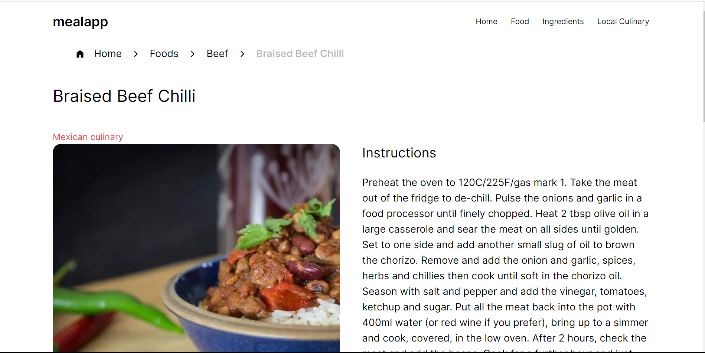

<h1 align="center">
  EatLah
</h1>

## Description

Mealapp adalah aplikasi untuk melihat resep - resep berdasarkan bahan bahan yg tersedia

## Built With

- [Next.js]
- [Tailwindcss]
- [axios]

## DEMO

[Live Demo Link](https://cmlabs-frontend-fulltime-test-alpha.vercel.app/)

## Screenshoot
<div align="center">
  
</div>

<div align="center">
  
</div>

<div align="center">
  
</div>

## 🛠 Installation & Set Up

1. Clone the repo
   ```sh
   git clone https://github.com/rdhss/cmlabs-frontend-fulltime-test.git
   ```
1. change dir
   ```sh
   cd cmlabs-frontend-fulltime-test
   ```
2. Install NPM packages
   ```sh
   npm install
   ```
3. Start the Application
   ```sh
   npm run dev
   ```